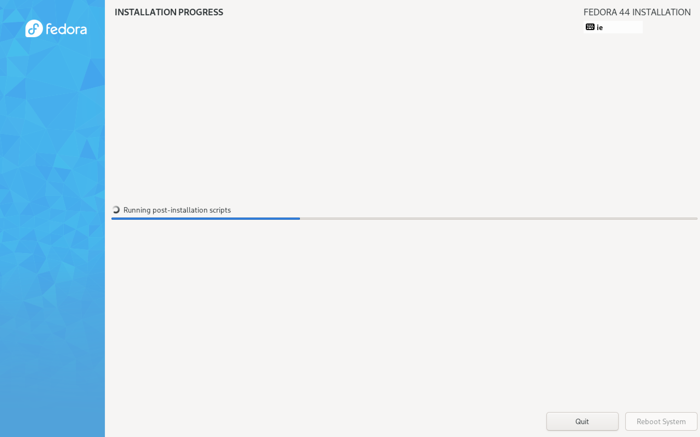
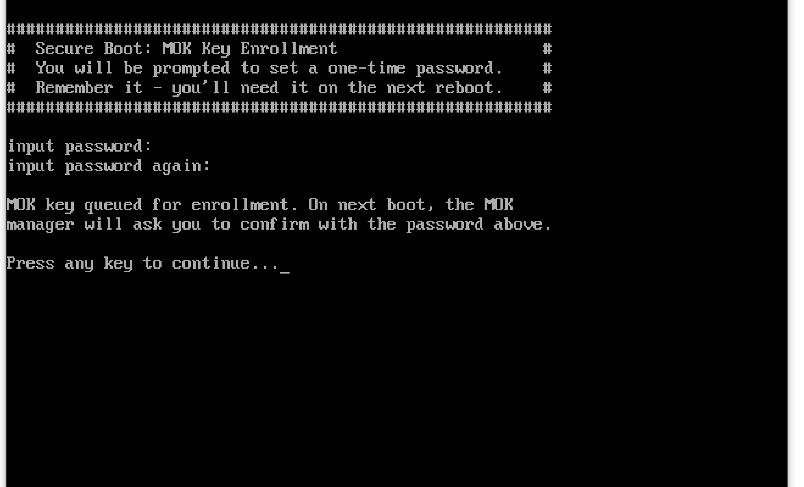
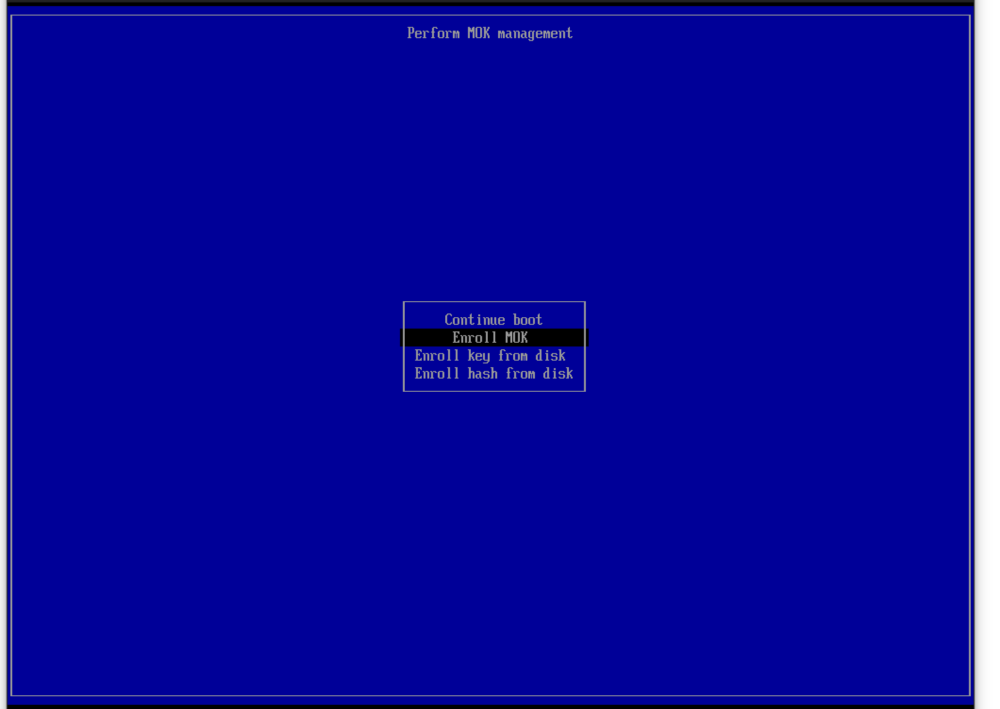
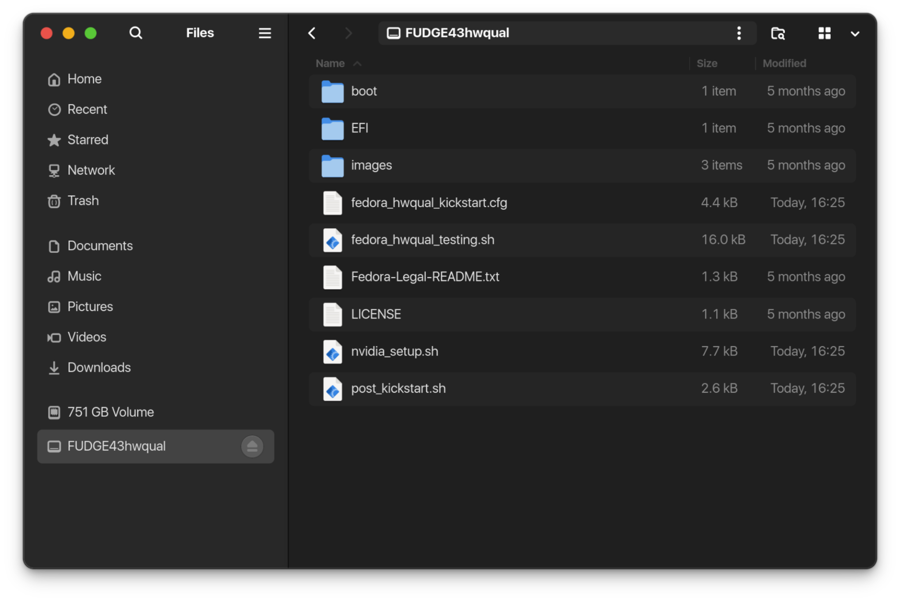
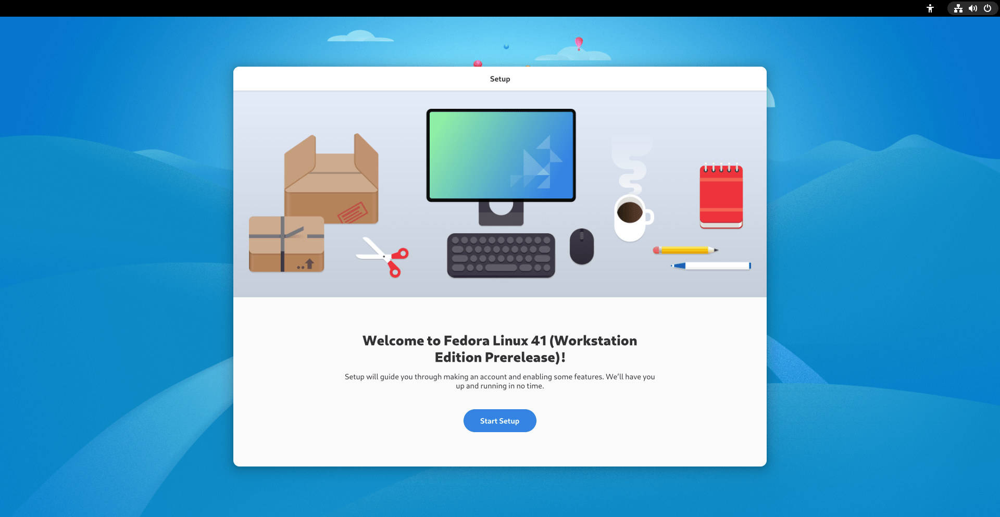
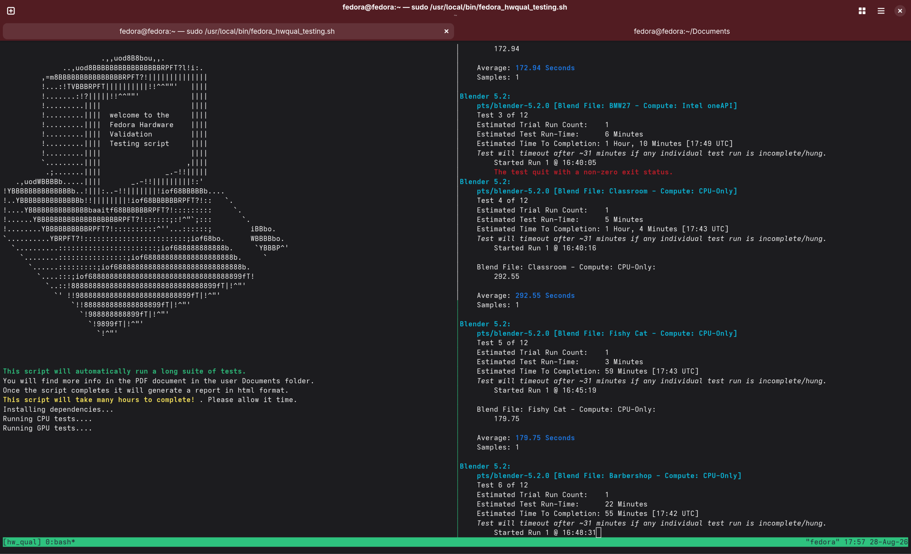
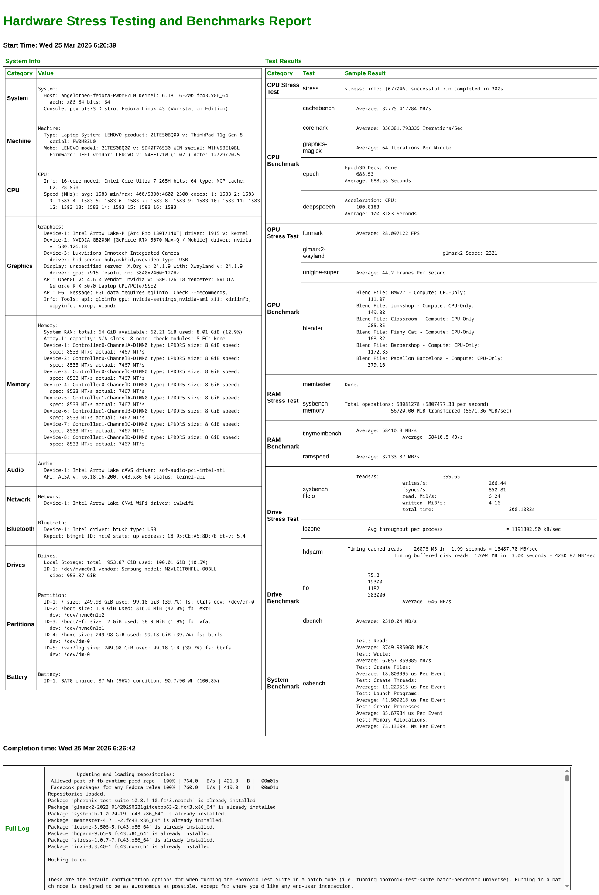

# Fedora Hardware validation QA framework

This qualification process started at Meta with the intention to be shared broadly through the Fedora Ready program.

The main premise of the Fedora hardware validation workflow shared here is to provide some guidance and tools for automated testing in order to assess a device usability, user experience and level of support for the Fedora operating system. The tests conducted are split into 2 categories:

1. Automated testing - This repository contains a bootable installer ISO based on the Fedora Everything netinstaller, a kickstart for automated provisioning, and some additional scripts for testing. These tests are a combination of known open-source stress tests and benchmarks.

2. Manual testing - This guide also provides documentation on some standard QA practices and tests that can be conducted manually, as well as documentation templates for completing a report which will mark a device as officially Fedora supported.

----

# Automated testing with custom ISO

## ISO Instalation Step by step

It is recommended to use a bootable USB drive with [Ventoy](https://www.ventoy.net/en/index.html).

Also note that if you have secure boot enabled, automatic MOK key enrollment for the akmods key will be attempted. This is to ensure that self-signed kernel modules are loaded on boot, like for example on devices with NVidia GPUs.

1. Boot the `fedora-fantasy-hwqual.iso` from your USB drive
2. The installer will automatically proceed if a network connection is detected. If not, connect to your network manually when prompted.
3. Allow the installation to proceed. The post_kickstart script will execute during the "Running post-installation scripts" step (progress can be monitored under TTY1 - Press CTRL + ALT + F1)

4. If secure boot is enabled you will be prompted to create a temporary password for the akmods MOK key. Once you set a password, press any key to resume the installation.

NOTE: The password here is completely temporary and will only be used during MOK Key enrollment. Something simple like "1234" is perfectly acceptable.

5. If everything went well, the device will automatically reboot. On the next reboot, MOK Key enrollment will be automatically initiated.

6. Proceed to enroll the akmods key to the BIOS following the prompts on the screen and by using the temp password you configured at the previous step.
7. Once you complete the MOK key enrollment, reboot the device.
8. Complete the Welcome to Fedora guide to create a user account etc.
9. The device is now ready to use for further testing.

----

## ISO structure

The ISO is built on top of the Fedora Everything netinstaller ISO as found on public Fedora repositories here: <https://fedoraproject.org/misc/#everything>

We include in the ISO the following 4 files which can also be found on the root path of the ISO when mounted as well as this repository.

### Phase 1 - Anaconda instalation

#### `fedora_hwqual_kickstart.cfg`

Kickstart is an answer file which can be provided to a netinstaller and automate the steps otherwise performed by user selections (for example, system language, desktop environment etc)

This kickstart roughly does the following:

* Defines the primary source repo to get official Fedora packages
* Answers some automation basics like language, region etc.
* Partitions a drive with a 2GB EFI partition,a 2GB EXT4 partition for /root and the rest of the drive as BTRFS
* Encrypts the drive with the simple passphrase “fedora”
* Installs the packages needed for @^workstation-product-environment
  * (this is the default workstation option when using the Fedora live Gnome ISO too)

* If all goes well, preps post_kickstart to start next.

Kickstart then goes to `fedora_stable_post_kickstart.sh`.

#### `post_kickstart.sh`

This is a script that is executed in the %post section of the anaconda kickstart flow which allows us to run certain steps additionally to a typical kickstart install.

Post kickstart does the following:

* Moves the scripts baked into the ISO to the /usr/local/bin/ system path
* Updates the kernel to the latest version as well as all system updates.
* Runs some additional package installs with dnf, like Google Chrome, benchmark tooling like phoronix-test-suite, glmark2 etc.
* Creates a randomly generated file used as a secondary LUKS decryption key so on reboot, the password prompt can be skipped
* Executes the next script bundled in the ISO to install Nvidia drivers if needed

#### `nvidia_setup.sh`

This script will handle Nvidia driver installation if Nvidia hardware is detected on the system. It can run under two different modes, rpmfusion and nvidia.

The first mode will install Nvidia drivers by enabling 3rd party rpmfusion repositories and use the driver provided by that repo and the open source kernel modules handled by akmod. This option is also the default during automated installer.

The second mode will install the official Nvidia driver from Nvidia’s cuda repository, using dkms to manage the provided kernel module. This is an option we provide to our Linux users if they require cuda libraries for development and they can uninstall the rpmfusion drivers and re-execute this script manually to switch to the official drivers instead of the rpmfusion ones.

After that the Anaconda part of the installation will be complete and the device will restart. The output of all the above scripts will be written in the log file at `/root/ks-post.log`.

### Phase 2 - Welcome to Fedora OOBE manual setup

The device will automatically restart after the Anaconda environment has finished installing the OS and the Welcome to Fedora OOBE screen will appear:

#### `fedora_hwqual_testing.sh`

This script is also added to the ISO but not executed automatically. It will be moved by the kickstart phase to `/usr/local/bin/` so it can be called from the terminal.

## Benchmark script design (`fedora_hwqual_testing.sh`)

As mentioned above, the script is automatically added in `/usr/local/bin/` so it can be easily called from a terminal window with the command: `fedora_hwqual_testing.sh`

The script will ask for sudo permissions due to certain actions requiring elevated priviledges (installing dependencies etc.)

It will then start running in a `tmux` environment. The primary steps will be displayed below the welcome art while the actual tests will be running in a split window on the side.

### Script UI:

The script is a collection of benchmark and stress tests separated into 5 main categories.

CPU, GPU, RAM, Drive, OS

Under each category, a collection of tests will be performed as follows:

### CPU

1. 5 Minute CPU stress test with `stress` on all cores
2. `cachebench` through the phoronix-test-suite
3. `coremark` through the phoronix-test-suite
4. `graphics-magick` through the phoronix-test-suite
5. `epoch` through the phoronix-test-suite
6. `deepspeech` through the phoronix-test-suite

### GPU

1. `furmark` stress test through phoronix-test-suite
2. `glmark2-wayland` benchmark
3. Unigine Superposition through phoronix-test-suite
4. `blender` off-screen rendering through phoronix-test-suite (also includes cpu testing)

Note here that before running any of these tests, the script will attempt to detect if the system uses Dual / Hybrid GPUs and Nvidia like certain laptops have and if so, attempt to run the tests against the discrete GPU rather than the primary running the gnome session.

### RAM

1. `memtester` stress test against 80% of the free system RAM (very time consuming on high spec systems)
2. `sysbench` memory speed test
3. `tinymembench` through the phoronix-test-suite
4. `ramspeed` through the photonix-test-suite

### Drive

1. `sysbench fileio` benchmark against 15G size page files
2. `iozone` benchmark
3. `hdparm` speedtest
4. `fio` speedtest through the phoronix-test-suite
5. `dbench` speedtest through the phoronix-test-suite

### Operating System

* Basic operating system functions testing with `osbench` through the phoronix-test-suite

## Final report

Once all tests are performed an HTML file report will be generated which will create a summary of the device specifications and the tests performed. The Device specification will be gathered with the tool inxi. The final report will look like this:

The complete log of all tests performed will be included in the HTML report but is also written here: `/root/hardware_validation.log`

----

# Manual testing

Additional testing performed besides the automated tests with the ISO above are documented below. These tests are usually performed by a QA engineer on an provisioned device, either provisioned ith the ISO in this repository or the Vanilla ISO officially provided by the Fedora Project.

----

## **Recommended Tools**

* GPU Tests
  * [glmark2](https://github.com/glmark2/glmark2)
  * [Blender](https://opendata.blender.org/)
  * [Unigine](https://benchmark.unigine.com/)

* CPU tests
  * [GTKStressTesting](https://flathub.org/apps/details/com.leinardi.gst)
  * [Geekbench](https://www.geekbench.com/download/)

* RAM test
  * [memtester](https://linux.die.net/man/8/memtester) (sudo dnf install memtester)
  * [sysbench](https://github.com/akopytov/sysbench) (sudo dnf install sysbench)

* battery test
  * [GNOME power statistics](https://flathub.org/apps/org.gnome.PowerStats) (sudo dnf install gnome-power-manager)

* Drive test
  * [KDiskMark](https://github.com/JonMagon/KDiskMark) (flatpak install flathub io.github.jonmagon.kdiskmark)

* Device specs tool
  * [inxi](https://github.com/smxi/inxi) (sudo dnf install inxi)

### Additional tooling to consider

* Hardware probe (hw-probe):[https://fedoraproject.org/wiki/Hardware_probe](https://fedoraproject.org/wiki/Hardware_probe)
  * Example output:[https://linux-hardware.org/?probe=273526bab2](https://linux-hardware.org/?probe=273526bab2)

## **Tests to perform**

Hardware tests:

* GPU tests
  * [glmark2](https://github.com/glmark2/glmark2)
    * glmark2-wayland --fullscreen
    * Capture score output and compare with others online

  * [Blender](https://opendata.blender.org/)
    * Ensure output matches overall GPU score from others online

  * [Unigine](https://benchmark.unigine.com/)
    * Ensure test runs at ultra graphics settings with expected score
    * No visible screen tearing

* CPU tests:
  * [GTKStressTesting](https://flathub.org/apps/details/com.leinardi.gst) (flatpak install flathub com.leinardi.gst)
    * System can maintain stability under 100% load for 30 mins

  * [Geekbench](https://www.geekbench.com/download/)
    * Performance scores match the hardware expectations

* Memory:
  * [memtester](https://linux.die.net/man/8/memtester)
    * Example command: sudo memtester 16G 3

  * [sysbench](https://github.com/akopytov/sysbench)
    * Example command: sysbench memory run

* Disk:[KDiskMark](https://github.com/JonMagon/KDiskMark) (flatpak install flathub io.github.jonmagon.kdiskmark)
  * SSD benchmark matches hardware expectations
    * Ensure CoW is disabled

* battery (if testing a laptop device): GNOME power statistics
  * For expected power consumption do the following:
    * Set power mode to Power Saver
    * Screen brightness to 50%
    * Caffeine to keep device awake
    * Run CPU stress test above to keep CPU usage at 15-20% (2-4 workers should suffice)

* TPM2.0 security chip
  * Ensure secure boot and 3rd party microsoft certs are enabled in the BIOS
  * Complete the installation with the hwqual ISO which secure boot is on
    * The installer will run through configuring akmods and enroll a self-signed certificate with MOK key enrollment
  * Enroll the drive LUKS encryption to the TPM. You can use one of the helper scripts from this repo: <https://github.com/angelotheodorakis/fedora-helper-scripts>

* External ports - USB ports - charging
* Webcam: Camera app should be enough
* Microphone:[https://zoom.us/test](https://zoom.us/test)
* Audio Input: System settings Microphone input gauge or zoom test call.
* Audio Output: System setting audio out test or zoom test call.
* WiFi: system settings - Wi-Fi -  connect to networks
* Bluetooth: system settings - Bluetooth - Connect to a bluetooth device
* Keyboard
  * During preboot (BIOS), LUKS and OS

* Mouse/Trackpad
  * During preboot (BIOS), LUKS and OS

Software tests:

* Vanilla OS installation (Workstation and/or Fedora KDE)
  * Any issues from the out of the box experience
  * Driver support
  * DNF update - LVFS firmware support (fwupdmgr update)

* Suspend/sleep - resume
* System settings functionality
  * Function keys
    * Change screen brightness
    * Volume control

  * Turn WiFi/Bluetooth on/off

(Optional) Final go/no-go test:

* Spend a week using the device as the daily driver

This test is usually a time sensitive one and relies on the tester's discretion. It is recommended to perform since there is no better way to get a feel of a device User Experience by using it as your daily driver for at least a week.

## **Results**

Results are captured in a spreadsheet using a provided template.

Additionally, we create and link the following 2 reports to the template so we have the exact specs of the devices qualified:

* output of sudo inxi -e
* output of sudo -E hw-probe -all -upload like here: <https://linux-hardware.org/?probe=a98b6568d5>

# TODO

* Results publishing page with tester's report.
* Report template
